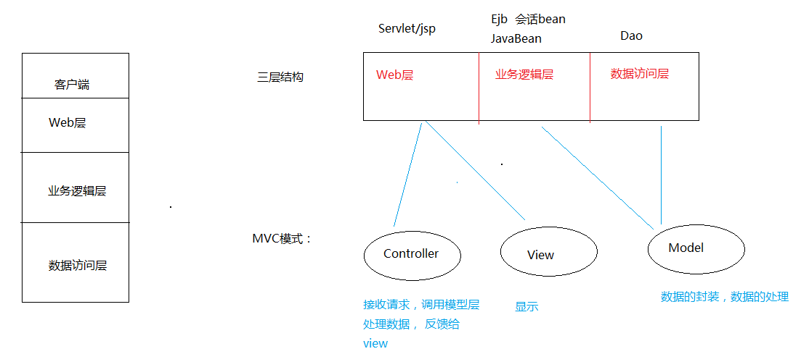

## MVC设计模式



### JSP开发模式


### 三层架构&MVC练习

## 查询

1. 先写一个JSP 页面， 里面放一个超链接 。

`<a href="StudentListServlet"> 学生列表显示</a>`

2. 写Servlet， 接收请求， 去调用 Service  , 由service去调用dao
3. 先写Dao , 做Dao实现。

```java
	public interface StudentDao {
		List<Student> findAll()  throws SQLException;
	}
```

* 实现接口

```java
	public class StudentDaoImpl implements StudentDao {
		@Override
		public List<Student> findAll() throws SQLException {
				QueryRunner runner = new QueryRunner(JDBCUtil.getDataSource());
				return runner.query("select * from stu", new BeanListHandler<Student>(Student.class));
		}
	}
```

4. 再Service , 做Service的实现。

```java
	/**
	 * 这是学生的业务处理规范
	 * @author xiaomi
	 *
	 */
	public interface StudentService {

		/**
		 * 查询所有学生
		 * @return  List<Student>
		 */
		List<Student> findAll()  throws SQLException ;
	}

	------------------------------------------

	/**
	 * 这是学生业务实现
	 * @author xiaomi
	 *
	 */
	public class StudentServiceImpl implements StudentService{
	
		@Override
		public List<Student> findAll() throws SQLException {
			StudentDao dao = new StudentDaoImpl();
			return dao.findAll();
		}
	}
```

5. 在servlet 存储数据，并且做出页面响应。

```java
	protected void doGet(HttpServletRequest request, HttpServletResponse response) throws ServletException, IOException {
		try {
			//1. 查询出来所有的学生
			StudentService service = new StudentServiceImpl();
			List<Student> list = service.findAll();
			
			//2. 先把数据存储到作用域中
			request.setAttribute("list", list);
			
			//3. 跳转页面
			request.getRequestDispatcher("list.jsp").forward(request, response);
		
	} catch (SQLException e) {
		e.printStackTrace();
	}
}
```

6. 在list.jsp上显示数据

	EL + JSTL  + 表格
	
```jsp
	<%@ page language="java" contentType="text/html; charset=UTF-8"
    pageEncoding="UTF-8"%>

    <%@ taglib prefix="c"  uri="http://java.sun.com/jsp/jstl/core"%>
    <!DOCTYPE html PUBLIC "-//W3C//DTD HTML 4.01 Transitional//EN" "http://www.w3.org/TR/html4/loose.dtd">
    <html>
    <head>
    <meta http-equiv="Content-Type" content="text/html; charset=UTF-8">
    <title>学生列表页面</title>

    <script type="text/javascript">

        function doDelete(sid) {
            /* 如果这里弹出的对话框，用户点击的是确定，就马上去请求Servlet。 
            如何知道用户点击的是确定。
            如何在js的方法中请求servlet。 */
            var flag = confirm("是否确定删除?");
            if(flag){
                //表明点了确定。 访问servlet。 在当前标签页上打开 超链接，
                //window.location.href="DeleteServlet?sid="+sid;
                location.href="DeleteServlet?sid="+sid;
            }
        }
    </script>

    </head>
    <body>
        <form action="SearchStudentServlet" method="post">
            <table border="1" width="700">

                <tr >
                    <td colspan="8">

                        按姓名查询:<input type="text" name="sname"/>
                        &nbsp;
                        按性别查询:<select name="sgender">
                                    <option value="">--请选择--
                                    <option value="男">男
                                    <option value="女">女
                                  </select>
                        &nbsp;&nbsp;&nbsp;
                        <input type="submit" value="查询">
                        &nbsp;&nbsp;&nbsp;
                        <a href="add.jsp">添加</a>
                    </td>
                </tr>

              <tr align="center">
                <td>编号</td>
                <td>姓名</td>
                <td>性别</td>
                <td>电话</td>
                <td>生日</td>
                <td>爱好</td>
                <td>简介</td>
                <td>操作</td>
              </tr>

                  <c:forEach items="${list }" var="stu">
                      <tr align="center">
                        <td>${stu.sid }</td>
                        <td>${stu.sname }</td>
                        <td>${stu.gender }</td>
                        <td>${stu.phone }</td>
                        <td>${stu.birthday }</td>
                        <td>${stu.hobby }</td>
                        <td>${stu.info }</td>
                        <td><a href="EditServlet?sid=${stu.sid }">更新</a>   <a href="#" onclick="doDelete(${stu.sid})">删除</a></td>
                      </tr>
                  </c:forEach>
              </table>
          </form>
    </body>
    </html>
```
## 增加

1. 先跳转到增加的页面 ， 编写增加的页面

2. 点击添加，提交数据到AddServlet . 处理数据。

3. 调用service

4. 调用dao, 完成数据持久化。

5. 完成了这些存储工作后，需要跳转到列表页面。 这里不能直接跳转到列表页面，否则没有什么内容显示。 应该先跳转到查询所有学生信息的那个Servlet， 由那个Servlet再去跳转到列表页面。

6. 爱好的value 值有多个。 

	```java
       request.getParameter("hobby");
       String[] hobby = request.getParameterValues("hobby") 
       String value = Arrays.toString(hobby): // [爱好， 篮球， 足球]
   ```
   
## 删除

1. 击超链接，弹出一个询问是否删除的对话框，如果点击了确定，那么就真的删除。

`<a href="#" onclick="doDelete(${stu.sid})">删除</a>`

2. 让超链接，执行一个js方法

```javaScript
<script type="text/javascript">

   		function doDelete(sid) {
   			/*	
            	如果这里弹出的对话框，用户点击的是确定，就马上去请求Servlet。 
                如何知道用户点击的是确定。
                如何在js的方法中请求servlet。
            */
   			var flag = confirm("是否确定删除?");
   			if(flag){
   				//表明点了确定。 访问servlet。 在当前标签页上打开 超链接，
   				//window.location.href="DeleteServlet?sid="+sid;
   				location.href="DeleteServlet?sid="+sid;
   			}
   		}
	</script>
```

3. 在js访问里面判断点击的选项，然后跳转到servlet。
4. servlet收到了请求，然后去调用service ， service去调用dao

## 更新

1. 点击列表上的更新， 先跳转到一个EditServlet 

>在这个Servlet里面，先根据ID 去查询这个学生的所有信息出来。
>
2. 跳转到更新的页面, 然后在页面上显示数据

```HTML
	<tr>
		<td>姓名</td>
		<td><input type="text" name="sname" value="${stu.sname }"></td>
	</tr>
	
	<tr>
		<td>性别</td>
		<td>
			<!-- 如果性别是男的，  可以在男的性别 input标签里面， 出现checked ,
			如果性别是男的，  可以在女的性别 input标签里面，出现checked -->
			<input type="radio" name="gender" value="男" <c:if test="${stu.gender == '男'}">checked</c:if>>男
			<input type="radio" name="gender" value="女" <c:if test="${stu.gender == '女'}">checked</c:if>>女
		</td>
	</tr>
	
	<tr>
		<td>爱好</td>
		<td>
			<!-- 爱好： 篮球 ， 足球 ， 看书 
			因为爱好有很多个，  里面存在包含的关系 -->
			<input type="checkbox" name="hobby" value="游泳" <c:if test="${fn:contains(stu.hobby,'游泳') }">checked</c:if>>游泳
			<input type="checkbox" name="hobby" value="篮球" <c:if test="${fn:contains(stu.hobby,'篮球') }">checked</c:if>>篮球
			<input type="checkbox" name="hobby" value="足球" <c:if test="${fn:contains(stu.hobby,'足球') }">checked</c:if>>足球
			<input type="checkbox" name="hobby" value="看书" <c:if test="${fn:contains(stu.hobby,'看书') }">checked</c:if>>看书
			<input type="checkbox" name="hobby" value="写字" <c:if test="${fn:contains(stu.hobby,'写字') }">checked</c:if>>写字
		
		</td>
	</tr>
```

3. 修改完毕后，提交数据到UpdateServlet

>提交上来的数据是没有带id的，所以我们要手动创建一个隐藏的输入框， 在这里面给定id的值， 以便提交表单，带上id。 
>

```html
	<form method="post" action="UpdateServlet">
		<input type="hidden" name="sid" value="${stu.sid }">
		...
	</form>
```

4. 获取数据，调用service， 调用dao.

## 分页功能

* 物理分页 （真分页）

>来数据库查询的时候，只查一页的数据就返回了。 
>

**优点：内存中的数据量不会太大
缺点：对数据库的访问频繁了一点。**

`select * from student limit 5 offset 2`

 ```sql
 	//跳过2条取出1条数据，limit后面是从第2条开始读，读取1条信息，即读取第3条数据
 	select * from table limit 2,1;
    
	/从第1条（不包括）数据开始取出2条数据，limit后面跟的是2条数据，offset后面是从第1条开始读取，即读取第2,3条
	select * from table limit 2 offset 1;
 ```

* 逻辑分页（假分页）

>一口气把所有的数据全部查询出来，然后放置在内存中.

**优点： 访问速度快。
缺点： 数据库量过大，内存溢出**

### 分页优化

```SELECT * FROM admininfo WHERE id LIMIT 0,5```

	从0开始（含0），向下找5条数据

```SELECT * FROM admininfo WHERE id LIMIT 3 OFFSET 5```

	从6开始（不含5），向下找3条

```SELECT * FROM admininfo ORDER BY id DESC LIMIT 0,5```

	DESC：以id降序
	ASC： 以id升序

根据雅虎的几位工程师带来了一篇Efficient Pagination Using MySQL的报告内容扩展：在文中提到一种clue的做法，给翻页提供一些线索，比如还是SELECT * FROM message ORDER BY id DESC，按id降序分页，每页20条，当前是第10页，当前页条目id最大的是1020，最小的是1000，如果我们只提供上一页、下一页这样的跳转（不提供到第N页的跳转），那么在处理的SQL语句可以是：

`SELECT * FROM message WHERE id>1020 ORDER BY id ASC LIMIT 20;`//下一页

`SELECT * FROM message WHERE id<1000 ORDER BY id DESC LIMIT 20;`//上一页
不管翻多少页，每次查询只扫描20行。

缺点是只能提供上一页、下一页的链接形式，但是我们的产品经理非常喜欢“上一页 1 2 3 4 5 6 7 8 9 下一页”这样的链接方式，怎么办呢？

如果`LIMIT m,n`不可避免的话，要优化效率，只有尽可能的让m小一下，我们扩展前面的clue做法，还是`SELECT * FROM message ORDER BY id DESC`，按id降序分页，每页20条，当前是第10页，当前页条目id最大的是2519，最小的是2500;
当是第10页的SQL如下：

`SELECT * FROM tb_goods_info WHERE auto_id >=2500 ORDER BY auto_id ASC LIMIT 0,20`

比如要跳到第9页，SQL语句可以这样写：

`SELECT * FROM tb_goods_info WHERE auto_id <2500 ORDER BY auto_id desc LIMIT 0,20`

比如要跳到第8页，SQL语句可以这样写：

`SELECT * FROM tb_goods_info WHERE auto_id <2500 ORDER BY auto_id desc LIMIT 20,20`

比如要跳到第7页，SQL语句可以这样写：

`SELECT * FROM tb_goods_info WHERE auto_id <2500 ORDER BY auto_id desc LIMIT 40,20`

跳转到第11页：

`SELECT * FROM tb_goods_info WHERE auto_id >2519 ORDER BY auto_id asc LIMIT 0,20`

跳转到第12页：

`SELECT * FROM tb_goods_info WHERE auto_id >2519 ORDER BY auto_id asc LIMIT 20,20`

跳转到第13页：

`SELECT * FROM tb_goods_info WHERE auto_id >2519 ORDER BY auto_id asc LIMIT 40,20`

原理还是一样，记录住当前页id的最大值和最小值，计算跳转页面和当前页相对偏移，由于页面相近，这个偏移量不会很大，这样的话m值相对较小，大大减少扫描的行数。其实传统的limit m,n，相对的偏移一直是第一页，这样的话越翻到后面，效率越差，而上面给出的方法就没有这样的问题。
　　
**意SQL语句里面的ASC和DESC，如果是ASC取出来的结果，显示的时候记得倒置一下。**

> <a href="https://blog.csdn.net/ainuser/article/details/72803175">引用自CSDN用户AinUser</a>
> 侵权删


